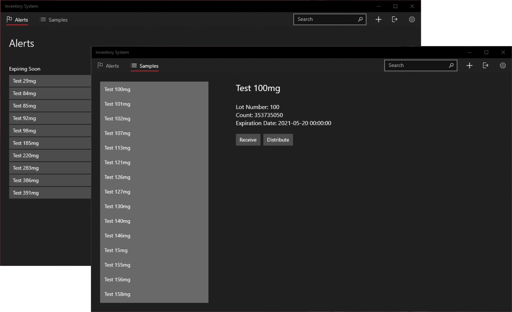

# 🏥 Inventory System

**Inventory System** is a medical sample inventory management system written for Windows 10 using the Universal Windows Platform. This project was originally created by [Box Analyst](https://github.com/Box-Analyst) for Conway Regional as our senior project in the [COMS 4043](https://www.atu.edu/catalog/descriptions/courses.php?catalog=U&subj=COMS#Search:~:text=COMS%204043%3A%20Systems%20Analysis%20and%20Design%20II) course at Arkansas Tech University.

## System Requirements

Windows 10, version 1903 (10.0; Build 18362) or higher.

## Building from source

- Install Visual Studio & UWP Development Kit.
- Clone this repository and open `InventorySystem.sln` in Visual Studio.
- Visual Studio should install any missing dependencies/packages for you.
- Run the program from Visual Studio.

## Acknowledgments

### Box Analyst

- [Allan Lee](https://github.com/alee18-atu)
- [JD Thayn](https://thayn.me/)
- [Dakota Gray](https://github.com/dgray22)
- [Joshua Chrestman](https://github.com/jchrestman2)
- [Paul Mickey](https://www.paulmickey.com/)

### Dependencies and References

This project utilizes the following NuGet packages:

- [Microsoft.Data.Sqlite](https://docs.microsoft.com/en-us/dotnet/standard/data/sqlite/?tabs=netcore-cli)
- [Microsoft.NETCore.UniversalWindowsPlatform](https://github.com/Microsoft/dotnet/blob/master/releases/UWP/README.md)
- [Microsoft.Toolkit.Uwp.Notifications](https://github.com/windows-toolkit/WindowsCommunityToolkit)
- [QueryString.NET](https://github.com/WindowsNotifications/QueryString.NET)
- [System.Configuration.ConfigurationManager](https://github.com/dotnet/runtime)

Thanks to [Jim Moua](https://jimmoua.github.io/) for the awesome [guide they made](https://github.com/jimmoua/system_analysis_tutorials) for our class.

## License

Copyright (c) [Box Analyst](https://github.com/Box-Analyst). Licensed under the [GNU AGPLv3 License](https://github.com/Box-Analyst/InventorySystem/blob/master/LICENSE).
